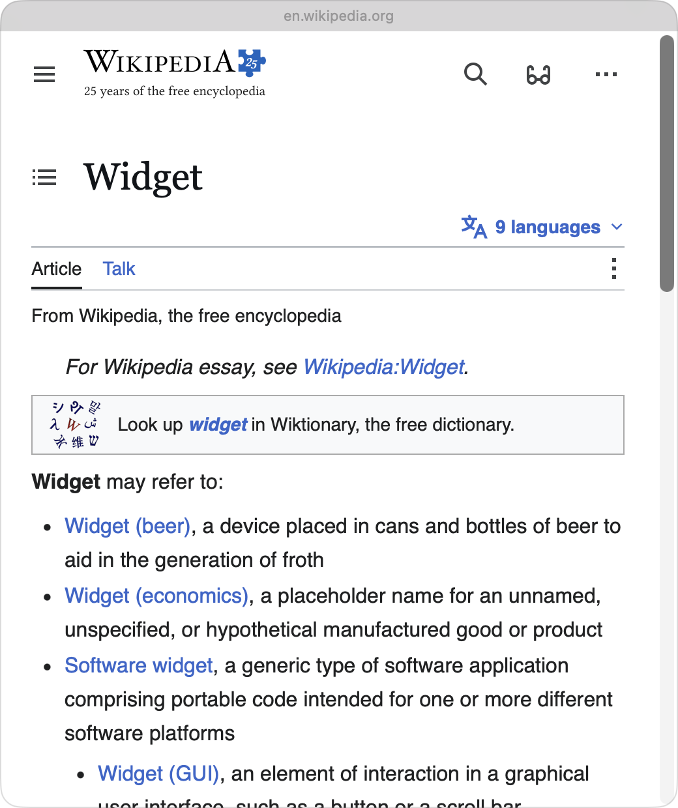
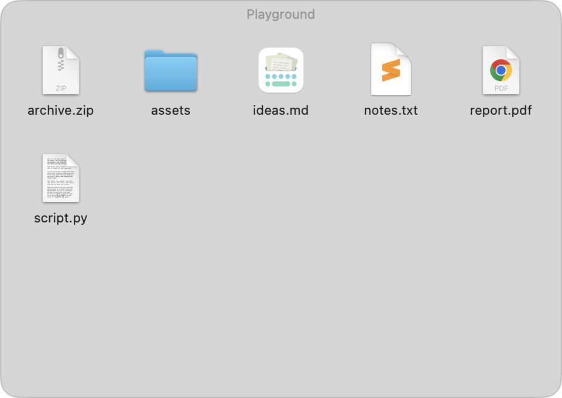
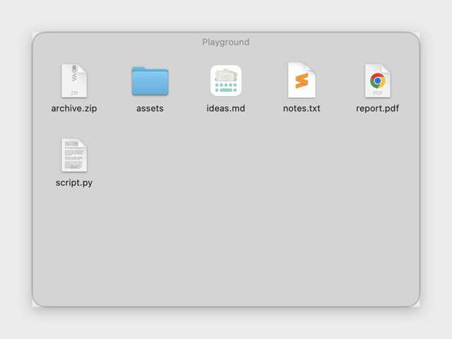

# TileTop

Lightweight desktop widgets for macOS — glassy tiles that live on your
desktop, right above the wallpaper and below your app windows, exactly like
Apple's built-in desktop widgets.

No Xcode, no WidgetKit, no Electron: a single small AppKit app compiled with
`swiftc` straight from the command line.

| Browser widget | Folder widget |
| :---: | :---: |
|  |  |

## Widgets

**🌐 Browser** — pin any web page to your desktop: a calendar, a dashboard,
docs, a stock ticker. Cookies persist across relaunches so logins stick, and a
Safari user agent keeps OAuth providers happy.

**📁 Folder** — a folder's contents as an icon canvas on your desktop:

- Drag files in with Finder semantics (move on the same volume, copy across
  volumes, hold **⌥** to force a copy) and drag files out.
- Double-click to open, **Return** to rename in place, **⌘⌫** to trash.
- Finder-style right-click menu: Open, Show in Finder, Rename, Duplicate,
  Copy / Paste, New Folder, Move to Trash.
- The widget follows the folder if it's renamed or moved, and shows a
  recovery overlay (Choose Folder… / Recreate Folder) if it's deleted —
  reattaching automatically if the folder comes back.

## Niceties

- **Roll-up**: double-click a widget's top bar to collapse it into a small
  capsule; double-click to bring it back.

  

- **Manager menu**: a grid icon in the menu bar to add, remove, resize, and
  configure widgets.
- **Float on Top**: temporarily lift a widget above other windows (handy for
  web logins).
- Positions, sizes, and roll-up states all persist across relaunches.

## Install

Requires macOS 13+ and the Xcode Command Line Tools (`xcode-select --install`).

```sh
git clone https://github.com/NeutrinoLiu/TileTop.git
cd TileTop
./build.sh
open build/TileTop.app
```

TileTop is a menu-bar app (no Dock icon) — look for the grid icon in the menu
bar and add your first widget from there.

To start it at login: System Settings → General → Login Items → **+** →
select `build/TileTop.app`.

## Notes

- The build is ad-hoc signed, so it runs on your own machine without a
  developer account.
- Widget configs are stored in `UserDefaults`; nothing ever leaves your Mac.

## License

[MIT](LICENSE)
