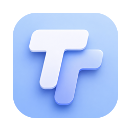

<p align="center"></p>

# TileTop — desktop widgets for macOS

**Pin any website or folder to your Mac desktop** as a lightweight, glassy
widget. TileTop tiles live right above the wallpaper and below your app
windows — the same layer as Apple's built-in desktop widgets — so they're
always there when you show the desktop, and never in the way when you work.

Native AppKit in a few hundred lines of Swift. No Electron, no Xcode project,
no WidgetKit sandbox limits — it builds with `swiftc` from the command line
and the binary weighs next to nothing.

| Browser widget — a web page on your desktop | Folder widget — files as an icon canvas |
| :---: | :---: |
|  |  |

## What you can pin

**🌐 Any web page** — calendar (Google Calendar, Fantastical web), Notion
pages, dashboards (Grafana, Home Assistant), stock/crypto tickers, weather,
docs, a YouTube live stream. Cookies persist across relaunches so logins
stick, and a Safari user agent keeps OAuth sign-ins (Google, etc.) working.

**📁 Any folder** — see a folder's contents as icons on your desktop, like a
mini Finder window that never closes:

- Drag files in with real Finder semantics (move on the same volume, copy
  across volumes, hold **⌥** to force a copy) and drag files out.
- Double-click to open, **Return** to rename in place, **⌘⌫** to trash.
- Finder-style right-click menu: Open, Show in Finder, Rename, Duplicate,
  Copy / Paste, New Folder, Move to Trash.
- If the folder is renamed or moved, the widget follows it. If it's deleted,
  a recovery overlay offers Choose Folder… / Recreate Folder and reattaches
  automatically if the folder comes back.

## Niceties

- **Roll-up**: double-click a widget's top bar to collapse it into a small
  capsule — double-click to expand it back.

  

- **Manager menu**: a menu-bar item to add, remove, resize, and configure
  widgets.
- **Float on Top**: temporarily lift a widget above other windows (handy for
  web logins).
- Positions, sizes, and roll-up states persist across relaunches.

## Install

Requires macOS 13+.

**Download**: grab `TileTop-x.y.z.zip` from
[Releases](https://github.com/NeutrinoLiu/TileTop/releases), unzip, and move
`TileTop.app` wherever you like. The build is ad-hoc signed (no paid developer
certificate), so on first launch macOS will warn you: right-click the app →
Open, or allow it under System Settings → Privacy & Security.

**Build from source**: needs the Xcode Command Line Tools
(`xcode-select --install` — the full Xcode is *not* needed).

```sh
git clone https://github.com/NeutrinoLiu/TileTop.git
cd TileTop
./build.sh
open build/TileTop.app
```

TileTop is a menu-bar app (no Dock icon) — look for the TT icon in the menu
bar and add your first widget from there.

To start it at login: System Settings → General → Login Items → **+** →
select `build/TileTop.app`.

## FAQ

**How is this different from Apple's desktop widgets?**
Apple's WidgetKit widgets are static snapshots that refresh on a schedule and
can't host arbitrary web pages or act as a live drop target. TileTop tiles
are real windows: a fully interactive browser you can scroll and click, and a
folder canvas you can drag files onto.

**How does it compare to Plash or Übersicht?**
[Plash](https://github.com/sindresorhus/Plash) puts one website *behind*
your desktop icons as a wallpaper layer; TileTop gives you any number of
smaller interactive tiles instead.
[Übersicht](https://github.com/felixhageloh/ubersicht) renders widgets you
write yourself in HTML/JS; TileTop needs no code — paste a URL or pick a
folder. And neither does the folder-canvas part.

**Does it phone home?**
No. There's no telemetry, no accounts, no network access beyond the pages
you pin. Configs are stored locally in `UserDefaults`.

**Why is the build unsigned?**
It's ad-hoc signed so it runs on your own machine without a paid developer
account. Build it yourself from source — that's the point.

## License

[Apache-2.0](LICENSE). Free to use, modify, and redistribute — but if you
redistribute TileTop or build on it, keep the [NOTICE](NOTICE) file crediting
the original author.
